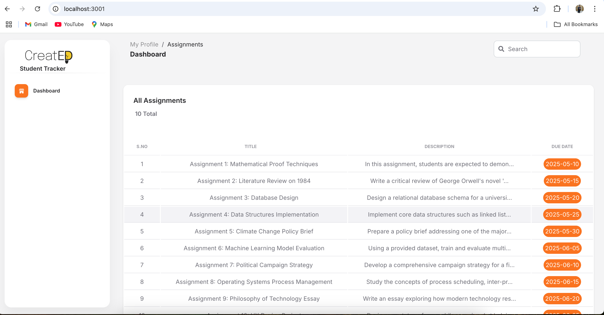

# Student Submission Tracker



This project is a basic web application designed to help students track and manage assignment submissions. The interface presents a modern, dark-themed layout where users can view a list of assignments and interact with them in a clean and organized format.

## Features

- Displays a list of assignments with task name, deadline, and status
- Assignments data is served from a local JSON file
- Express.js server for routing and API endpoints
- Uses EJS for server-side rendering
- Static frontend assets (CSS, JS, fonts, images) are organized and modular
- Designed with responsiveness and usability in mind

## Folder Structure
├── app.js # Main Express server
├── package.json # Node.js dependencies and scripts
├── package-lock.json
├── .gitignore
├── data/
│ └── assignments.json # Assignment data source
├── docs/
│ └── home-page.png # Screenshots used in the README
├── node_modules/ # Installed dependencies
├── public/ # Static assets
│ ├── assets/
│ │ ├── css/ # Stylesheets
│ │ ├── js/ # JavaScript
│ │ ├── img/ # Images
│ │ └── fonts/ # Web fonts
├── views/ # EJS templates
│ ├── partials/ # Shared layout components
│ ├── rough_template/ # Optional drafts or layout ideas
│ └── index.ejs # Homepage showing assignment list


## Getting Started

### Prerequisites

Ensure that you have Node.js and npm installed on your system.

### Installation

1. Clone the repository:

```bash
git clone https://github.com/netviral/student-tracker
cd student-tracker
```

## Getting Started

### Installation

1. Install dependencies:

    ```bash
    npm install
    ```

2. Run the server:

    ```bash
    node app.js
    ```

3. Open the application in your browser:

    ```
    http://localhost:3001
    ```

---

## API Endpoints

### `GET /api/assignments`

Returns the list of assignments in JSON format. This data is loaded from `data/assignments.json`.

---

## Future Enhancements

- Add functionality to upload submissions against each assignment  
- Enable editing or resubmitting assignments before deadlines  
- Include a comment box and submission timestamp tracking  
- Build student login and authentication pages  
- Expand the backend to use a database instead of a static JSON file  

---

## License

This project is for educational purposes only and does not include any proprietary or commercial components.
