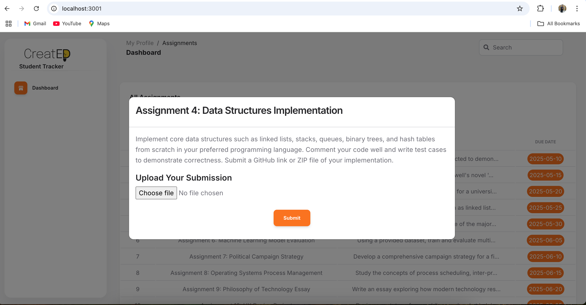

# Student Submission Tracker




This project is a basic web application designed to help students track and manage assignment submissions. The interface presents a modern, light-themed layout where users can view a list of assignments and interact with them in a clean and organized format.

## Features

- Displays a list of assignments with task name, deadline, and status
- Assignments data is served from a local JSON file
- Express.js server for routing and API endpoints
- Uses EJS for server-side rendering
- Static frontend assets (CSS, JS, fonts, images) are organized and modular
- Designed with responsiveness and usability in mind

## Folder Structure
```
├── app.js # Main Express server
├── package.json # Node.js dependencies and scripts
├── package-lock.json
├── .gitignore
├── data/
│ └── assignments.json # Assignment data source
├── docs/
│ └── home-page.png # Screenshots used in the README
├── node_modules/ # Installed dependencies
├── public/ # Static assets
│ ├── assets/
│ │ ├── css/ # Stylesheets
│ │ ├── js/ # JavaScript
│ │ ├── img/ # Images
│ │ └── fonts/ # Web fonts
├── views/ # EJS templates
│ ├── partials/ # Shared layout components
│ ├── rough_template/ # Optional drafts or layout ideas
│ └── index.ejs # Homepage showing assignment list
```

# Logic Note: Assignment Task List and Submission System

This Express.js application provides a simple assignment management interface. It allows users to:

1. **View a list of assignments** (on the homepage),
2. **View details of each assignment** (if implemented),
3. **Submit files** to specific assignments using a file upload form.

Below is a detailed breakdown of how each part of the logic works.

---


---

## Core Modules Used

- `express`: Web framework for routing and handling HTTP requests.
- `path`: Provides utilities for working with file and directory paths.
- `fs`: Enables reading/writing JSON data from/to files.
- `multer`: Handles file uploads.

---

## Homepage: Display Assignment List

**Route: `/`**

This route reads the list of assignments from `data/assignments.json` and renders the homepage using the `index.ejs` template.

### Logic:
1. Uses `fs.readFile()` to load `assignments.json`.
2. Parses the JSON string into a JavaScript array of assignments.
3. Passes the array (`assignments`) and a stringified version (`assignmentString`) to the EJS view for rendering.

```js
app.get('/', (req, res) => {
  const dataPath = path.join(__dirname, 'data', 'assignments.json');
  fs.readFile(dataPath, 'utf8', (err, jsonData) => {
    if (err) return res.status(500).send('Error loading assignments');
    const assignments = JSON.parse(jsonData);
    res.render('index', { assignments, assignmentString: JSON.stringify(assignments) });
  });
});
```

---

## File Uploads (Submissions)

**Route: `POST /api/upload-submission/:assignment_id`**

Handles file uploads from users and associates the uploaded file with the appropriate assignment based on its ID.

### File Upload Setup:
- `multer.diskStorage()` is used to:
  - Store files in the `/uploads` directory.
  - Rename the file to a timestamp plus its original extension (to avoid conflicts).

```js
const storage = multer.diskStorage({
  destination: (req, file, cb) => {
    cb(null, path.join(__dirname, 'uploads'));
  },
  filename: (req, file, cb) => {
    cb(null, Date.now() + path.extname(file.originalname));
  }
});
const upload = multer({ storage: storage });
```

### Upload Logic:
1. **Extract Assignment ID** from the URL (e.g., `/api/upload-submission/abc123`).
2. **Check for uploaded file**. If missing, return error.
3. **Read `assignments.json`**.
4. **Find matching assignment** using `.find()` on assignment ID.
5. **If found**, create or update the `submissions` array.
6. **Add new submission info**:
   - Original filename
   - Filepath in the `uploads/` directory
   - Upload timestamp
7. **Write updated data** back to `assignments.json`.

```js
app.post('/api/upload-submission/:assignment_id', upload.single('file'), (req, res) => {
  const assignmentId = req.params.assignment_id;
  const file = req.file;

  if (!file) return res.status(400).json({ success: false, message: 'No file uploaded' });

  const dataPath = path.join(__dirname, 'data', 'assignments.json');
  fs.readFile(dataPath, 'utf8', (err, jsonData) => {
    if (err) return res.status(500).json({ success: false, message: 'Error loading assignments' });

    const assignments = JSON.parse(jsonData);
    const assignment = assignments.find(a => a.id === assignmentId);
    if (!assignment) return res.status(404).json({ success: false, message: 'Assignment not found' });

    if (!assignment.submissions) {
      assignment.submissions = [];
    }

    assignment.submissions.push({
      filename: file.originalname,
      filePath: path.join('uploads', file.filename),
      uploadedAt: new Date()
    });

    fs.writeFile(dataPath, JSON.stringify(assignments, null, 2), (err) => {
      if (err) return res.status(500).json({ success: false, message: 'Error saving assignment data' });
      res.status(200).json({ success: true, message: 'File uploaded successfully' });
    });
  });
});
```

---

## Additional Setup

- **Templating Engine**: EJS is set as the view engine to render `.ejs` files.
- **Static Files**: All CSS/JS files in `/public` are served to the frontend.
- **URL Encoding Middleware**: `express.urlencoded()` is enabled for processing form inputs if needed later.

---

## Error Handling

**Catch-all route** for anything undefined returns a basic `404` message.

```js
app.use((req, res) => {
  res.send('404');
});
```

---

## Server Startup

The server listens on port **3001** and logs a message when it starts.

```js
app.listen(PORT, () => {
  console.log(`Server running at http://localhost:${PORT}`);
});
```

---

## Summary

- Data is persisted in a JSON file (`assignments.json`), simulating a lightweight database.
- Each assignment can store multiple file submissions.
- Files are uploaded using `multer`, renamed uniquely, and stored under `/uploads`.
- Submissions are linked to assignments based on their `id`, which must be passed in the URL.
- The system is modular and ready for front-end integration using EJS templates and static files.

---

## Future Enhancements

- Enable editing or resubmitting assignments before deadlines  
- Include a comment box and submission timestamp tracking  
- Build student login and authentication pages  
- Expand the backend to use a database instead of a static JSON file  

---

## License

This project is for educational purposes only and does not include any proprietary or commercial components.
